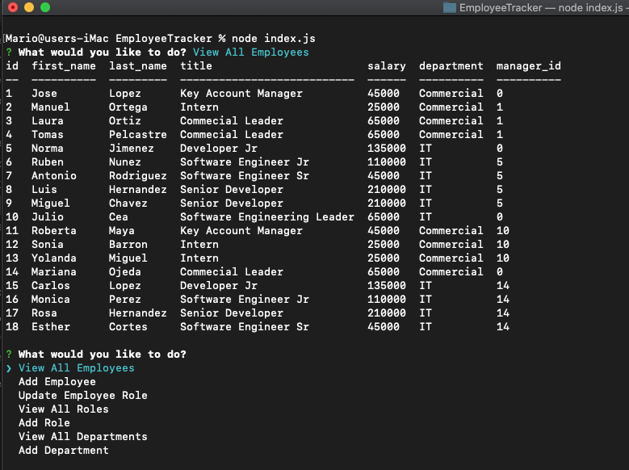

# ** Employee Tracker **

## Description
This is a server App to create interfaces that allow non-developers to easily view and interact with information stored in databases. It is a command-line application to manage a company's employee database, using Node.js, Inquirer, and MySQL.

##Database Schema

   
## Table of Contents
* [Description](#description)
* [Usage](#usage)
  
    ## License 
    This project is license under the "https://opensource.org/licenses/MIT"
* [Installation](#installation)
* [Tests](#tests)
* [Contact](#contact)

## Usage
    Ones you clone the repository in your local drive, just run "npm install" and run "node index.js" 
    

## License
    MIT

## Installation
    After clone the repo just run "npm install" to download all dependencies

## Test
 node index.js

## Autor
    For any question or inquiery
* GitHub: [mariopatino](https://github.com/mariopatino)

    